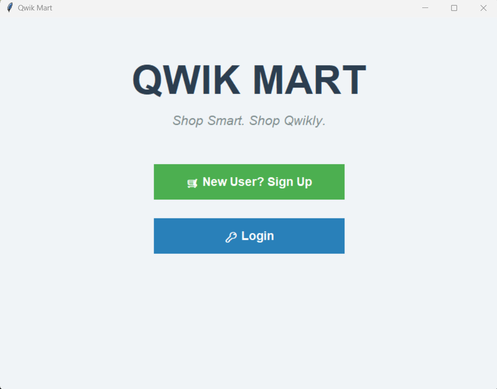
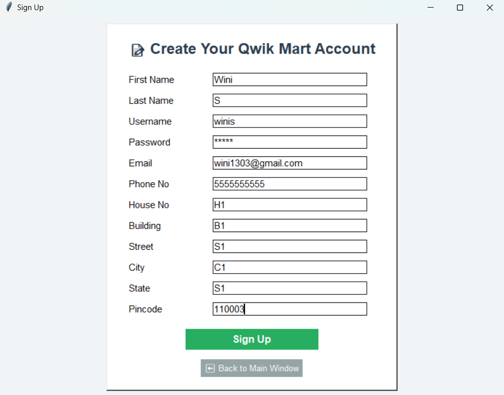
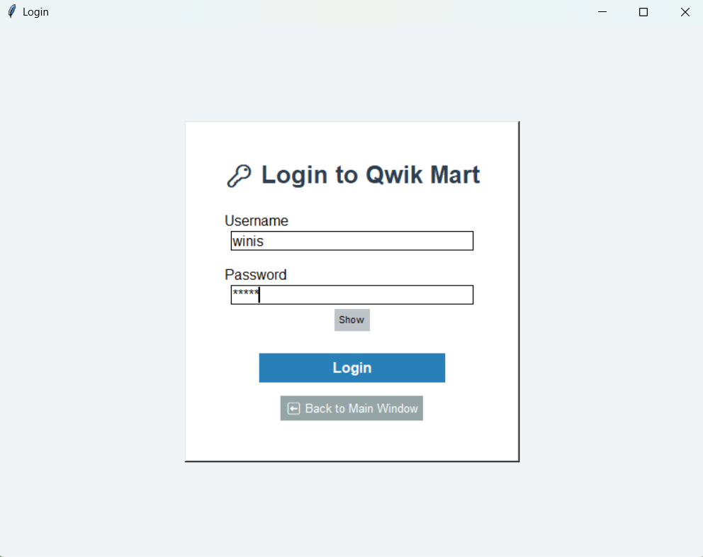
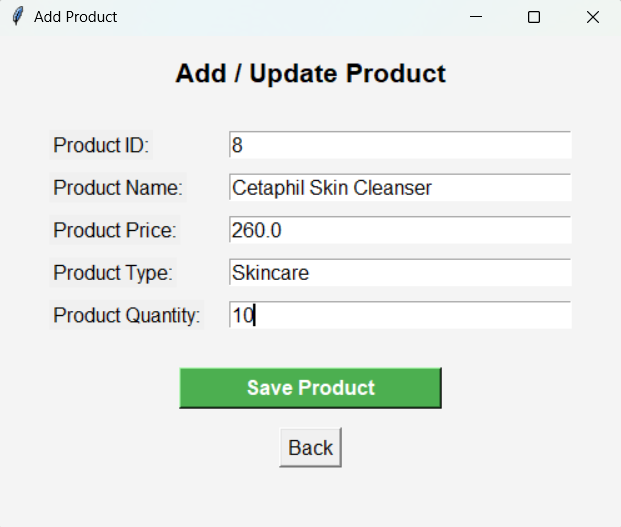
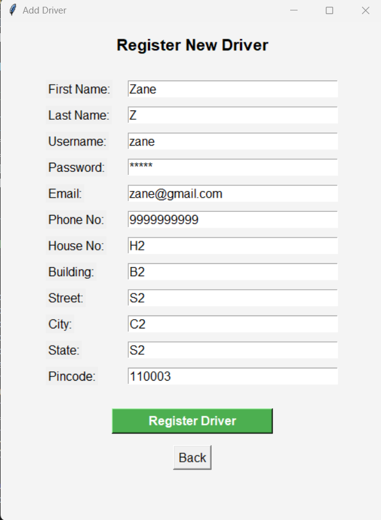
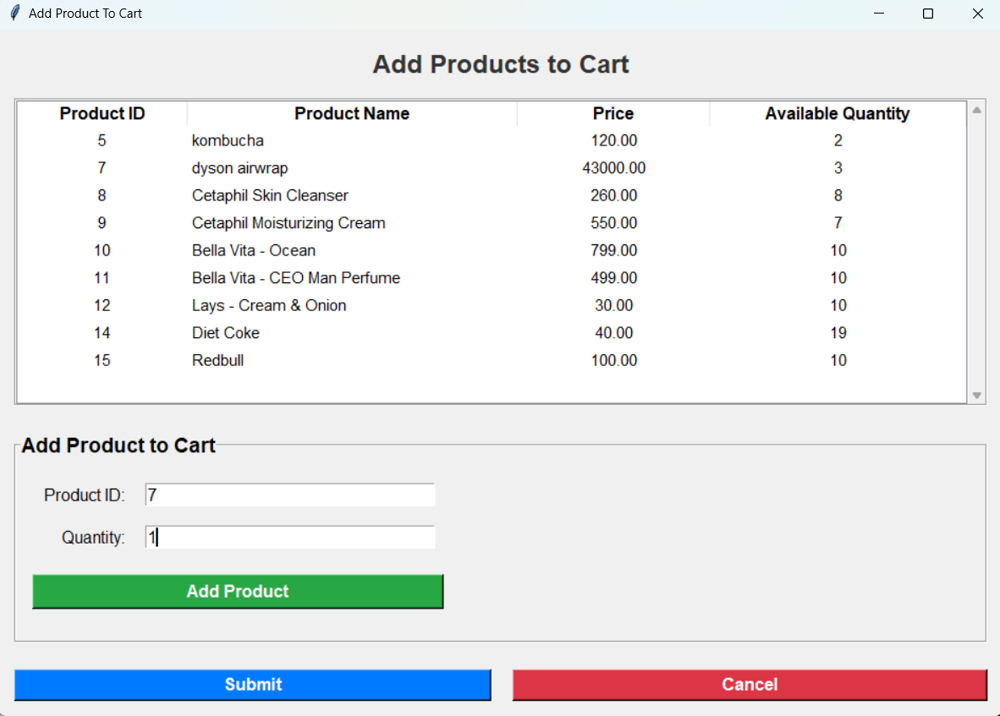
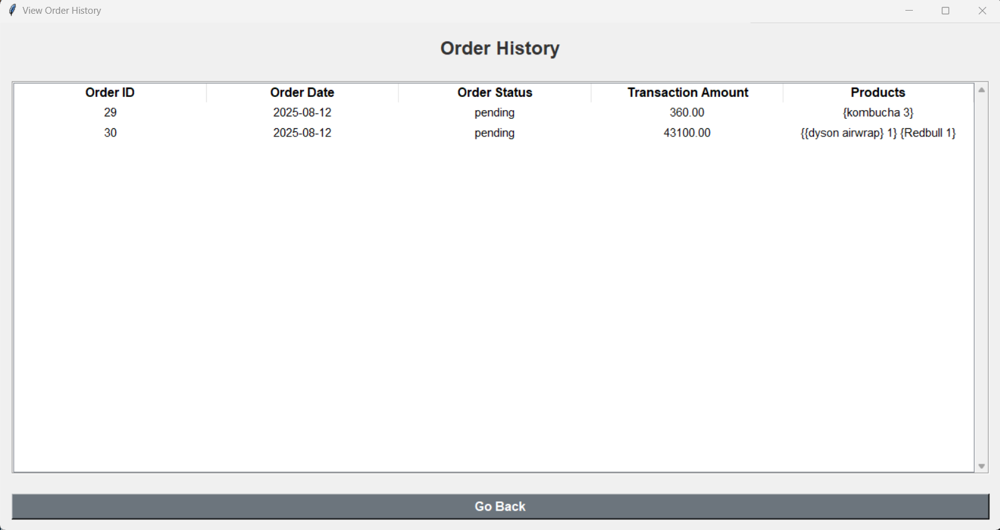
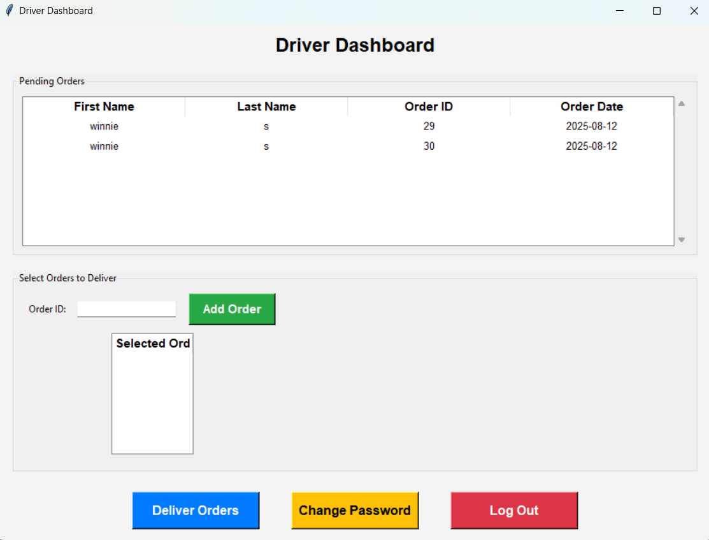

# Qwik Mart – Quick Commerce Application

Qwik Mart is a quick commerce desktop application built with Python Tkinter for the UI and MySQL as the database.  
It supports customers, admins, and drivers with role-based access.

---

## 1. Authentication Page
Login/Signup screen. Customers can sign up or log in. Admins and drivers can only log in.
  

## 2. Signup Page
Customers enter personal details to create a new account.
  

## 3. Login Page
Common login page for customers, admins, and drivers.
  

## 4. Add Product Page
Admin page to add new products with ID, name, price, type, and quantity.
  

## 5. Add New Driver Page
Admin page to register new drivers with their details.
  

## 6. Add Product to Cart Page
Customer page to add selected products to the cart and place an order.
  

## 7. View Order History Page
Customers can view past orders and their delivery status.
  

## 8. Deliver Order Page
Driver page to view pending orders in their pincode and mark deliveries.
  
